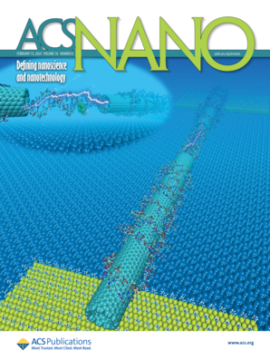
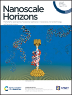

<h1 align="center">Dr. Busra Demir Senyildiz</h1>
<h3 align="center">Senior Computational Chemist | AI for Materials Discovery</h3>

I’m a computational chemist and R&D manager specializing in nanotechnology, materials science, and AI-driven solutions. Currently, I help translate complex challenges into innovative, practical results as a Digital Materials Scientist at Unilever. 

  

With experience spanning academia and industry, I’ve applied methods like molecular dynamics, quantum mechanics, and machine learning to solve problems in materials science and biology. My goal is to drive innovation by merging digital tools with cutting-edge research to create sustainable, impactful solutions.

<h3 align="left">📚 Research Papers - selected as cover:</h3>

  

     
    <a href="https://pubs.acs.org/doi/abs/10.1021/acsnano.3c10844">
      Self-Aligning Nanojunctions for Integrated Single-Molecule Circuits
    </a>
  
 
  
  

     
    <a href="https://pubs.rsc.org/en/content/articlelanding/2021/nh/d1nh00211b/unauth">
      Role of intercalation in the electrical properties of nucleic acids for use in molecular electronics
    </a>
  

<h3 align="left">Connect with me:</h3>

<h3 align="left">Languages and Tools:</h3>

 

  

        

